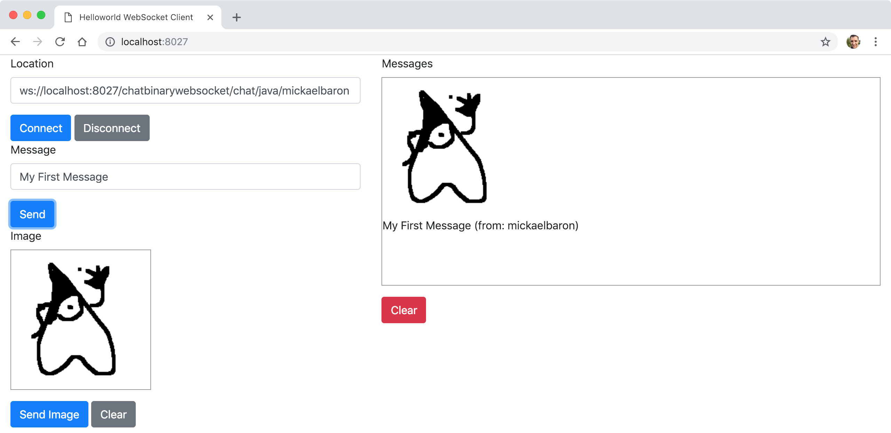

# Projet ws-chatwebsocket

Cet exemple implémente un espace de discussion « chat » en utilisant la spécification Jakarta WebSocket (anciennement JSR 356) et l'implémentation Tyrus. L'intérêt de cet exemple est de montrer comment transmettre des messages au format binaire.

Un client HTML/JavaScript a été développé pour implémenter le WebSocket client et afin de pouvoir tester notre développement (répertoire _static/_). Nous montrons également comment déployer les WebSockets serveurs comme une application Java classique par l'intermédiaire du serveur web Grizzly.



## Comment compiler

- À la racine du projet, exécuter la ligne de commande suivante :

```bash
mvn clean package
```

## Comment exécuter

- Toujours depuis la racine du projet, exécuter la ligne de commande suivante :

```bash
java -cp "target/classes:target/dependency/*" fr.mickaelbaron.chatbinarywebsocket.ChatWebSocketLauncher
```

La sortie console attendue :

```bash
mars 17, 2025 3:54:53 PM org.glassfish.grizzly.http.server.NetworkListener start
INFO: Started listener bound to [0.0.0.0:8027]
mars 17, 2025 3:54:53 PM org.glassfish.grizzly.http.server.HttpServer start
INFO: [HttpServer] Started.
mars 17, 2025 3:54:53 PM org.glassfish.tyrus.server.Server start
INFO: WebSocket Registered apps: URLs all start with ws://localhost:8027
mars 17, 2025 3:54:53 PM org.glassfish.tyrus.server.Server start
INFO: WebSocket server started.
Tyrus app started available at ws://localhost:8027/chatwebsocket/chat
Hit enter to stop it...
```

## Tester

Un WebSocket serveur est disponible à partir de cette URL :

- <ws://localhost:8026/chatbinarywebsocket/chat/{chatroom}/{username}> : permet de se connecter au WebSocket serveur en indiquant un salon et un nom d'utilisateur (implémentation via l'annotation `@ServerEndpoint`.

Pour tester :

- depuis un navigateur web, saisir l'URL suivante : <http://localhost:8027/> ;

- appuyer sur **Connecter** ;

- dessiner dans la zone **Image** ;

- appuyer sur **Send Image** pour envoyer votre création ;

- visualiser le résultat sur la zone _Messages_.

**Note:** pour s'apercevoir de l'intérêt des WebSockets, ouvrir plusieurs onglets via l'adresse <http://localhost:8027/>. Cela simulera la présence de plusieurs clients.
