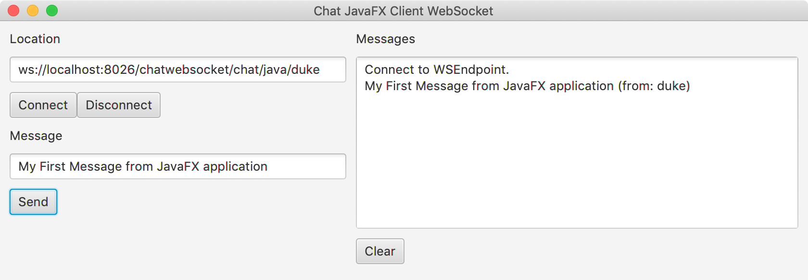

# Projet ws-chatjavafxclientwebsocket

Cet exemple montre comment utiliser la spécification Jakarta WebSocket (anciennement JSR 356) et l'implémentation Tyrus pour développer un WebSocket client avec le langage Java et la bibliothèque graphique OpenJFX. Pour tester ce  client, vous devrez démarrer le WebSocket serveur du projet [ws-chatwebsocket](../ws-chatwebsocket).



## Démarrer le WebSocket serveur du projet _ws-chatwebsocket_

* Se déplacer à la racine du projet _ws-chatwebsocket_

* Compiler le projet

```console
$ mvn clean package
```

* Exécuter le projet

```console
java -cp "target/classes:target/dependency/*" fr.mickaelbaron.helloworldwebsocket.HelloworldWebSocketLauncher
janv. 21, 2022 6:53:34 PM org.glassfish.grizzly.http.server.NetworkListener start
INFO: Started listener bound to [0.0.0.0:8025]
janv. 21, 2022 6:53:34 PM org.glassfish.grizzly.http.server.HttpServer start
INFO: [HttpServer] Started.
janv. 21, 2022 6:53:34 PM org.glassfish.tyrus.server.Server start
INFO: WebSocket Registered apps: URLs all start with ws://localhost:8025
janv. 21, 2022 6:53:34 PM org.glassfish.tyrus.server.Server start
INFO: WebSocket server started.
Tyrus app started available at ws://localhost:8025/helloworldwebsocket
Hit enter to stop it...
```

## Comment compiler

* À la racine du projet _ws-chatjavafxclientwebsocket_, exécuter la ligne de commande suivante :

```console
$ mvn clean package
```

## Comment exécuter avec Maven

* Toujours depuis la racine du projet, exécuter la ligne de commande suivante :

```console
$ mvn exec:java
[INFO] Scanning for projects...
[INFO]
[INFO] ------------< fr.mickaelbaron:ws-chatjavafxclientwebsocket >------------
[INFO] Building Chat JavaFX Client WebSocket Application 1.0.0-SNAPSHOT
[INFO] --------------------------------[ jar ]---------------------------------
[INFO]
[INFO] --- exec-maven-plugin:1.6.0:java (default-cli) @ ws-chatjavafxclientwebsocket ---
```

## Comment exécuter avec Java

* Toujours depuis la racine du projet, exécuter la ligne de commande suivante :

```console
$ java -cp 'target/classes:target/dependency/*' --module-path target/dependency --add-modules=javafx.fxml,javafx.controls fr.mickaelbaron.chatjavafxclientwebsocket.ChatJavaFXClientWebSocketApplication
```

**Note:** pour s'apercevoir de l'intérêt des WebSockets, exécuter plusieurs fois l'application JavaFX. Cela simulera la présence de plusieurs clients.