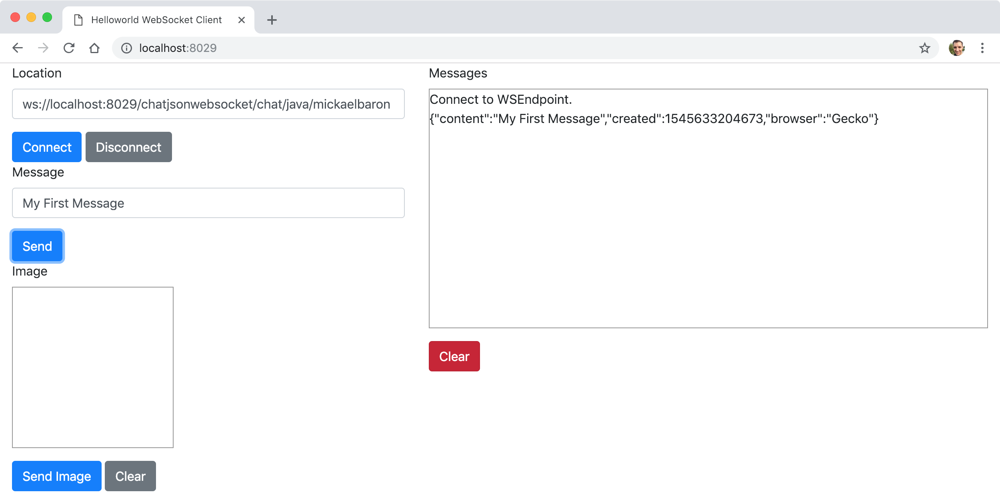

# Projet ws-chatjsonwebsocket

Cet exemple montre comment mettre en place l'encodage et le décodage pour personnaliser les messages d'un WebSocket serveur en utilisant la spécification Jakarta WebSocket (anciennement JSR 356), l'implémentation Tyrus et le langage Java.

Un client HTML/JavaScript a été développé pour implémenter le WebSocket client et afin de pouvoir tester notre développement (répertoire _static/_). Nous montrons également comment déployer les WebSockets serveurs comme une application Java classique par l'intermédiaire du serveur web Grizzly.



## Comment compiler

- À la racine du projet, exécuter la ligne de commande suivante :

```bash
mvn clean package
```

## Comment exécuter

- Toujours depuis la racine du projet, exécuter la ligne de commande suivante :

```bash
java -cp "target/classes:target/dependency/*" fr.mickaelbaron.chatjsonwebsocket.ChatWebSocketLauncher
```

La sortie console attendue :

```bash
mars 17, 2025 3:57:28 PM org.glassfish.grizzly.http.server.NetworkListener start
INFO: Started listener bound to [0.0.0.0:8029]
mars 17, 2025 3:57:28 PM org.glassfish.grizzly.http.server.HttpServer start
INFO: [HttpServer] Started.
mars 17, 2025 3:57:28 PM org.glassfish.tyrus.server.Server start
INFO: WebSocket Registered apps: URLs all start with ws://localhost:8029
mars 17, 2025 3:57:28 PM org.glassfish.tyrus.server.Server start
INFO: WebSocket server started.
Tyrus app started available at ws://localhost:8029/chatjsonwebsocket
Hit enter to stop it...
```

## Tester

Un WebSocket serveur est disponible à partir de cette URL :

- <ws://localhost:8029/chatjsonwebsocket/chat/{chatroom}/{username}> : permet de se connecter au WebSocket serveur en indiquant un salon et un nom d'utilisatuer.

Pour tester :

- depuis un navigateur web, saisir l'URL suivante : <http://localhost:8029/> ;

- modificer le champ *Location* en prenant l'une des deux URL présentées ci-dessus ;

- appuyer sur le bouton **Connecter** ;

- saisir un texte depuis le champ *Message* ;

- appuyer sur le bouton **Send** ;

- visualiser le résultat au format JSON sur la zone _Messages_.

**Note:** pour s'apercevoir de l'intérêt des WebSockets, ouvrir plusieurs onglets via l'adresse <http://localhost:8029/>. Cela simulera la présence de plusieurs clients.
