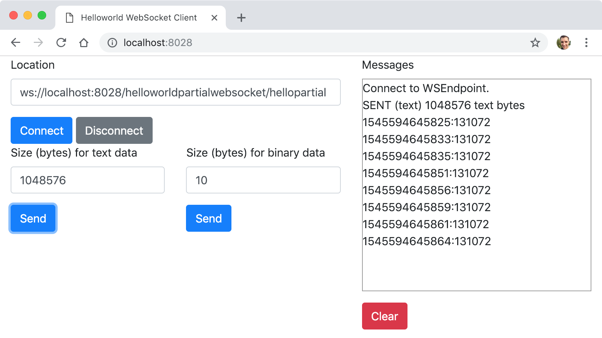

# Projet ws-helloworldpartialwebsocket

Cet exemple montre comment segmenter l'envoi de messages (WebSocket client vers un WebSocket serveur) en utilisant la spécification JSR 356 et l'implémentation Tyrus pour développer des WebSockets serveurs en Java.

Un client HTML/JavaScript a été développé pour implémenter le WebSocket client et afin de pouvoir tester notre développement (répertoire _static/_). Le client permet de générer des messages de tailles importantes. Nous montrons également comment déployer les WebSockets serveurs comme une application Java classique par l'intermédiaire du serveur web Grizzly.



## Comment compiler

* À la racine du projet, exécuter la ligne de commande suivante :

```bash
mvn clean package
```

## Comment exécuter

* Toujours depuis la racine du projet, exécuter la ligne de commande suivante :

```bash
$ java -cp "target/classes:target/dependency/*" fr.mickaelbaron.helloworldpartialwebsocket.HelloworldPartialWebSocketLauncher
déc. 23, 2018 11:17:41 PM org.glassfish.grizzly.http.server.NetworkListener start
INFO: Started listener bound to [0.0.0.0:8028]
déc. 23, 2018 11:17:41 PM org.glassfish.grizzly.http.server.HttpServer start
INFO: [HttpServer] Started.
déc. 23, 2018 11:17:42 PM org.glassfish.tyrus.server.Server start
INFO: WebSocket Registered apps: URLs all start with ws://localhost:8028
déc. 23, 2018 11:17:42 PM org.glassfish.tyrus.server.Server start
INFO: WebSocket server started.
Tyrus app started available at ws://localhost:8028/helloworldpartialwebsocket
Hit enter to stop it...
```

## Tester

Deux WebSockets serveurs sont disponibles respectivement à partir de ces URL :

* <ws://localhost:8028/helloworldpartialwebsocket/hellopartial> : WebSocket serveur permettant de recevoir un message de manière segmenter ;
* <ws://localhost:8028/helloworldpartialwebsocket/hellomessagemax> : WebSocket serveur où une taille limite du message est fixée.

Pour tester :

* depuis un navigateur web, saisir l'URL suivante : <http://localhost:8028/> ;

* modificer le champ _Location_ en prenant l'une des deux URL présentées ci-dessus ;

* appuyer sur le bouton **Connecter** ;

* saisir une valeur (en octet) dans l'un des deux champs : _Size (bytes) for text data_ ou _Size (bytes) for binary data_ ;

* appuyer sur l'un des deux boutons **Send** ;

* visualiser le résultat sur la zone _Messages_.