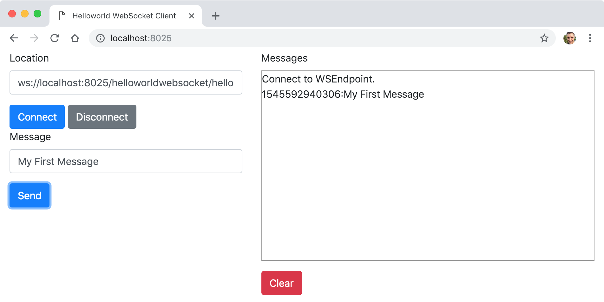

# Projet ws-helloworldwebsocket

Cet exemple montre comment utiliser la spécification Jakarta WebSocket (anciennement JSR 356) et l'implémentation Tyrus pour développer des WebSockets serveurs en Java.

Un client HTML/JavaScript a été développé pour implémenter le WebSocket client et afin de pouvoir tester notre développement (répertoire _static/_). Nous montrons également comment déployer les WebSockets serveurs comme une application Java classique par l'intermédiaire du serveur web Grizzly.



## Comment compiler

* À la racine du projet, exécuter la ligne de commande suivante :

```console
$ mvn clean package
```

## Comment exécuter

* Toujours depuis la racine du projet, exécuter la ligne de commande suivante :

```console
$ java -cp "target/classes:target/dependency/*" fr.mickaelbaron.helloworldwebsocket.HelloworldWebSocketLauncher
janv. 21, 2022 6:39:50 PM org.glassfish.grizzly.http.server.NetworkListener start
INFO: Started listener bound to [0.0.0.0:8025]
janv. 21, 2022 6:39:50 PM org.glassfish.grizzly.http.server.HttpServer start
INFO: [HttpServer] Started.
janv. 21, 2022 6:39:50 PM org.glassfish.tyrus.server.Server start
INFO: WebSocket Registered apps: URLs all start with ws://localhost:8025
janv. 21, 2022 6:39:50 PM org.glassfish.tyrus.server.Server start
INFO: WebSocket server started.
Tyrus app started available at ws://localhost:8025/helloworldwebsocket
Hit enter to stop it...
```

## Tester

Trois WebSockets serveurs sont disponibles respectivement à partir de ces URL :

* <ws://localhost:8025/helloworldwebsocket/hello> : transmet à tous les WebSockets clients connectés le message reçu par le WebSocket serveur ;
* <ws://localhost:8025/helloworldwebsocket/hellosinglereturn> : permet de retourner au WebSocket client le message reçu par le WebSocket serveur en utilisant le retour de la méthode ;
* <ws://localhost:8025/helloworldwebsocket/hellosinglesession> : permet de retourner au WebSocket client le message reçu par le WebSocket serveur en utilisant l'API `sendText` de la classe `Session`.

Pour tester :

* depuis un navigateur web, saisir l'URL suivante : <http://localhost:8025/> ;

* modificer le champ _Location_ en prenant l'une des trois URL présentées ci-dessus ;

* appuyer sur le bouton **Connecter** ;

* saisir un texte depuis le champ _Message_ ;

* appuyer sur le bouton **Send** ;

* visualiser le résultat sur la zone _Messages_.

**Note:** pour s'apercevoir de l'intérêt des WebSockets, ouvrir plusieurs onglets via l'adresse <http://localhost:8025/>. Cela simulera la présence de plusieurs clients.
  